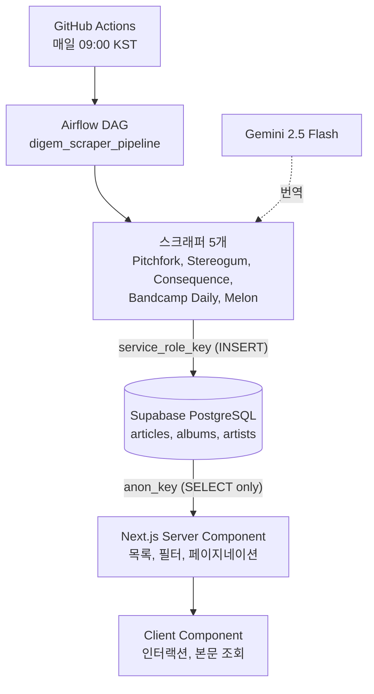
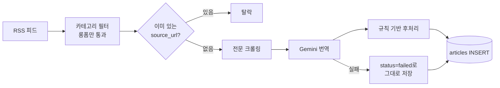

<div align="center">

# digem

**dig your uncut gems**

해외 음악 웹진의 칼럼을 매일 자동으로 모아 한국어로 번역해 쌓아 둡니다.

<a href="https://www.dig-em.com/"></a>


</div>

---

## 왜 만들었나

음악 평론에서 읽을 만한 글은 대부분 영어입니다. Pitchfork, Stereogum, Consequence 같은 매체가 매일 롱폼 칼럼을 내놓는데, 번역기에 통째로 넣으면 장르명과 연주 기법이 엉뚱하게 바뀌어 문장이 무너집니다.

digem은 이 문제를 **수집과 번역을 파이프라인으로 고정하는 방식**으로 풀었습니다. 매일 정해진 시각에 새 칼럼만 골라 가져오고, 음악 평론 문맥을 반영한 규칙으로 번역해 쌓습니다. 사람이 개입하는 단계는 없습니다.

---

## 아키텍처 — 서로를 모르는 두 반쪽



수집하는 쪽과 보여주는 쪽이 **서로의 존재를 모릅니다.** 스크래퍼는 프론트엔드가 있는지 모르고, 프론트엔드는 데이터가 어떻게 만들어졌는지 모릅니다. 둘 사이의 계약은 **DB 스키마 하나**뿐입니다.

한쪽을 고쳐도 다른 쪽이 깨지지 않는 대신, **스키마를 바꾸면 양쪽을 손으로 맞춰야 합니다.** 컴파일러가 잡아주지 않는 종류의 결합입니다.

---

## 칼럼 한 건이 지나가는 길



순서에 의도가 들어간 지점이 두 곳입니다. **중복 체크가 크롤링과 번역보다 앞에 있고**, **번역 실패도 버리지 않고 저장합니다.** 둘 다 아래에 이유를 적었습니다.

---

## 설계 판단

<details>
<summary><b>중복 체크를 번역보다 앞에 둔 이유</b></summary>

<br/>

Gemini 호출은 돈이 들고 느립니다. 이미 수집한 기사를 다시 번역하면 그만큼 그대로 낭비됩니다.

그래서 중복 판정을 **전문 크롤링보다도 먼저** 돌립니다. RSS에서 받은 `source_url` 목록으로 DB를 한 번 조회해 이미 있는 것을 걸러내고, 남은 것만 크롤링과 번역으로 넘깁니다.

비용이 드는 단계를 뒤로 밀고, 싼 판정을 앞으로 당기는 순서입니다.

</details>

<details>
<summary><b>번역이 실패해도 저장하고, 재시도하지 않는 이유</b></summary>

<br/>

번역이 실패하면 원문만 넣고 `translation_status='failed'`로 표시해 저장합니다. 프론트엔드는 `success`인 것만 조회하므로 화면에는 나오지 않습니다.

**재시도 로직을 만들지 않고 "한 번 실패하면 버린다"를 택했습니다.** 실패 건도 DB에 남기 때문에 다음 실행에서 `source_url` 중복 체크에 걸려 다시 시도되지 않습니다.

재시도를 넣으면 무엇을 몇 번까지 다시 할지, 실패가 쌓일 때 어떻게 멈출지를 모두 설계해야 합니다. 하루에 한 번 도는 배치에서 기사 몇 건을 놓치는 비용이 그 복잡도보다 싸다고 봤습니다.

실패 사유는 한 줄로 정규화해 컬럼에 남깁니다. 원본 예외를 그대로 흘리면 해석할 수 없는 문자열이 DB에 쌓입니다.

</details>

<details>
<summary><b>모델의 추론을 끄고 규칙 기반 후처리로 옮긴 이유 — 토큰 65% 절감</b></summary>

<br/>

`gemini-2.5-flash`는 thinking(내부 추론)이 기본으로 켜져 있고, 출력 예산과 요금을 함께 씁니다.

실측해 보니 **번역문 대비 1.7~4.9배의 토큰이 thinking에만 쓰이고 있었습니다. 전체의 약 65%입니다.**

그런데 켜고 끈 번역 품질 차이는 거의 없었습니다. 차이가 나는 항목이 딱 두 개였는데, **중복 영문 병기 정리**와 **앞뒤 노이즈 제거**였습니다. 둘 다 문자열 대조로 판정할 수 있는 일이라 결정론적 후처리로 옮기고 thinking 예산을 0으로 내렸습니다.

**모델이 못 지키는 규칙을 모델에게 반복해서 요구하는 대신, 모델에게는 식별 가능한 표시만 맡기고 판정은 코드로 내렸습니다.** 품질은 유지하고 토큰은 65% 줄었습니다.

중간값(2048, 4096)은 오히려 용어 설명 규칙이 사라져서 쓰지 않습니다. 0 아니면 기본값입니다.

</details>

<details>
<summary><b>중복 영문 병기를 어떻게 지우는가 — 백틱을 표시로 쓴다</b></summary>

<br/>

번역 규칙은 "아티스트명은 첫 언급에만 영문을 병기하고 이후에는 한글만"입니다. 프롬프트로 요구해도 장문에서는 지켜지지 않았습니다.

해법은 판정을 코드로 옮기는 것이었는데, 그러려면 **병기가 어디인지 기계가 알아야** 합니다. 그래서 프롬프트에서 영문 부분을 백틱으로 감싸게 했습니다. 병기가 자연어가 아니라 **식별 가능한 마크업**이 되는 순간입니다.

이제 후처리는 정규식으로 백틱 구간만 뽑아 **두 번째 등장부터 지웁니다.**

```python
def repl(m):
    k = m.group(1).split(';')[0].strip()
    if k in seen:
        return ''
    seen.add(k)
    return '`' + best[k] + '`'
```

**백틱 구간만 지우면 앞의 한글은 그대로 남습니다.** 문장이 깨지지 않으니 삭제가 안전합니다. 같은 항목이 한국어 풀이가 딸린 형태와 없는 형태로 둘 다 나오면, 설명이 있는 쪽을 첫 등장 위치에 남깁니다.

실측: 11건에 적용해 **중복 병기 5건에서 0건, 노이즈 7줄 제거, 본문 손실 0건.**

</details>

<details>
<summary><b>노이즈 제거를 본문 앞뒤로만 제한한 이유</b></summary>

<br/>

매체 템플릿에서 들어오는 타임스탬프, 다음 코너 예고, 뉴스레터 홍보 같은 문구를 지웁니다.

이때 **본문 전체를 훑지 않고 앞 3줄과 뒤 4줄만 검사합니다.** 노이즈가 앞뒤에만 붙는다는 관찰에 근거한 제한입니다.

중간 문단을 건드리지 않는 이유는 **오탐의 대가가 비대칭이기 때문**입니다. 노이즈 한 줄이 남는 것과 본문 한 문단이 잘려 나가는 것은 심각도가 다릅니다. 검사 범위를 좁히면 놓치는 노이즈가 생기지만, 본문을 훼손할 가능성은 사라집니다.

</details>

<details>
<summary><b>매체 5곳을 템플릿 메서드로 묶은 이유</b></summary>

<br/>

매체마다 RSS 구조와 HTML이 다릅니다. 그런데 **"RSS를 읽고, 카테고리로 걸러내고, 중복을 확인하고, 본문을 가져와, 번역하고, 저장한다"는 순서는 전부 같습니다.**

그래서 `BaseScraper`가 순서를 확정하고, 서브클래스는 달라지는 두 지점만 채웁니다.

```
BaseScraper (ABC)
├── run(limit)              전체 흐름. 서브클래스가 건드리지 않는다
├── _parse_date()           공통 유틸
├── _extract_content()      공통 유틸, 본문 문단 수집
├── fetch_articles()        @abstractmethod  매체마다 다름
└── fetch_full_content()    @abstractmethod  매체마다 다름
```

매체를 추가할 때 파이프라인 순서를 다시 쓰지 않아도 되고, 순서를 고치면 5곳에 한 번에 반영됩니다.

예외는 `BandcampDailyScraper` 하나입니다. Cloudflare 때문에 Selenium을 쓰는데, `run()`을 오버라이드해 부모의 `run()`을 `try` 안에서 호출하고 `finally`에서 드라이버를 종료합니다. **예외가 나든 말든 브라우저 프로세스를 반드시 정리해야** 하기 때문입니다. 안 하면 러너에 좀비 프로세스가 남습니다.

</details>

<details>
<summary><b>서버 없이 Airflow를 돌리는 방법</b></summary>

<br/>

Airflow는 보통 스케줄러가 상시 떠 있어야 합니다. 개인 프로젝트에서 그 서버를 유지하는 비용이 아까웠습니다.

digem은 **GitHub Actions 러너 안에서 Airflow를 매번 새로 설치하고 초기화한 뒤 한 번 실행하고 버립니다.**

```
GitHub Actions      언제 돌릴 것인가, 실행 환경 제공
      ↓
Apache Airflow      무엇을 어떤 순서로, 재시도와 타임아웃 정책
      ↓
Python 스크래퍼     실제로 무엇을 할 것인가
```

스케줄링과 오케스트레이션을 다른 계층으로 나눈 셈입니다. 스케줄링은 Actions의 cron이 맡고, Airflow는 DAG 정의와 실패 정책만 담당합니다.

`PYTHONPATH`를 저장소 루트로 지정하지 않으면 DAG 안의 `scripts` 패키지 import가 실패합니다. Airflow 설정은 `AIRFLOW__<섹션>__<키>` 형식의 환경변수로 덮어씁니다.

</details>

<details>
<summary><b>읽기 키와 쓰기 키를 나눈 이유</b></summary>

<br/>

Supabase에 두 개의 키로 접근합니다.

| 주체 | 키 | 권한 |
| --- | --- | --- |
| 스크래퍼 | `service_role_key` | RLS 우회, INSERT |
| 프론트엔드 | `anon_key` | SELECT only |

프론트엔드 키는 **브라우저로 내려가기 때문에 공개된 것으로 취급해야 합니다.** 그 키로 쓰기가 되면 누구나 데이터를 넣을 수 있습니다.

Row Level Security로 `anon` 역할에 SELECT만 허용하고, 쓰기는 서버 쪽에서만 쓰는 `service_role_key`로 제한했습니다. 키가 노출되는 것을 막는 대신 **노출되어도 할 수 있는 일을 줄이는** 접근입니다.

</details>

---

## 기술 스택

| 영역 | 사용 기술 |
| --- | --- |
| **수집** | Python 3.11, requests, BeautifulSoup4, feedparser, lxml, Selenium(Bandcamp), Pydantic |
| **번역** | Gemini 2.5 Flash (REST 직접 호출, thinking 비활성) |
| **오케스트레이션** | Apache Airflow 2.10, GitHub Actions (cron 스케줄링) |
| **저장** | Supabase (PostgreSQL), Row Level Security |
| **캐시** | Upstash Redis |
| **프론트엔드** | Next.js 16, React 19, TypeScript 5, Tailwind CSS 4 |
| **배포** | Vercel |
| **수집 대상** | Pitchfork, Stereogum, Consequence, Bandcamp Daily, Melon |

SDK 대신 Gemini REST API를 직접 호출합니다. `google-generativeai` 구버전에는 thinking 설정 자체가 없고 버전별 호환 문제가 보고되어 있어서, 요청 형식이 고정된 REST가 SDK 버전에 영향받지 않기 때문입니다.

---

## 프로젝트 구조

```
digem/
├── scripts/
│   ├── main.py                    진입점, 스크래퍼 순차 실행
│   ├── column/
│   │   ├── base_scraper.py        파이프라인의 심장, 템플릿 메서드
│   │   ├── pitchfork_scrapers.py  피드 2개 병합, 카테고리 화이트리스트
│   │   ├── stereogum_scraper.py   태그 기반 필터
│   │   ├── consequence_scraper.py Editorials만, RSS에서 크레딧 추출
│   │   └── bandcamp_scraper.py    Selenium, 드라이버 정리
│   ├── melon_scraper.py           앨범 메타, 번역 없음
│   ├── google_translator.py       Gemini 번역과 규칙 기반 후처리
│   └── database_loader.py         Supabase CRUD 전담
├── airflow/dags/
│   └── digem_scraper_pipeline.py  DAG 정의
├── frontend/                      Next.js
│   ├── app/                       App Router 페이지
│   ├── components/                기사 상세 등
│   └── lib/                       Supabase 클라이언트, 타입
├── supabase/                      스키마와 마이그레이션
├── tools/melon_seed.py            일회성 대량 시딩
└── docs/                          아키텍처, 파이프라인, 데이터 모델 문서
```

---

## 알려진 한계

문서화 과정에서 코드를 다시 읽으며 확인한 것들입니다. 고치지 않은 상태로 기록해 둡니다.

- **Airflow가 실제로는 순차 실행됩니다.** CI에서 메타 DB를 SQLite로 쓰는데, SQLite는 `SequentialExecutor`만 지원합니다. DAG는 5개 Task를 병렬로 선언했지만 한 번에 하나씩 돕니다
- **`scraper_pool`을 만드는 코드가 없습니다.** 5개 Task가 모두 이 pool을 참조하는데 pool을 생성하는 호출이 어디에도 없어서, 의도한 동시성 제한이 실제로 걸리는지 불확실합니다
- **스크래퍼 목록이 두 곳에 있습니다.** `main.py`의 리스트와 DAG의 하드코딩된 함수 목록입니다. 하나만 고치면 로컬 실행과 CI 실행이 갈라집니다
- **인덱스를 적용하지 않았습니다.** 현재 데이터량에서는 문제가 없지만 조회 패턴은 이미 정해져 있습니다
