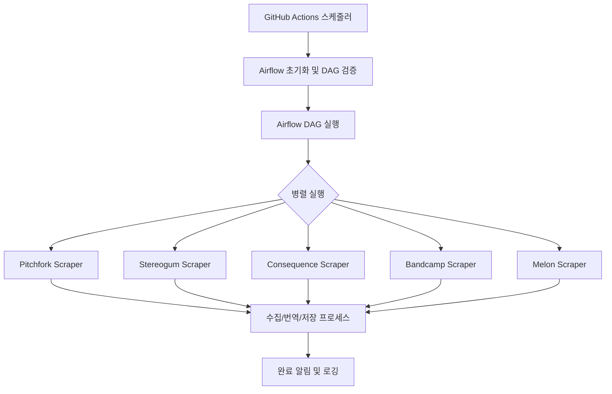

# dig-em.com — 구조 및 플랜

## 기술 스택

| 레이어 | 기술 |
|---|---|
| 프론트엔드 | Next.js 16 (App Router), React 19, TypeScript 5 |
| 백엔드 DB | Supabase (PostgreSQL) |
| 캐시/카운터 | Upstash Redis (미구현) |
| 번역 AI | Google Gemini 2.5 Flash |
| 데이터 수집 | Python 3.13, requests, BeautifulSoup4, feedparser, Selenium |
| 워크플로우 자동화 | Apache Airflow 2.10 (DAG 기반 파이프라인) |
| CI/CD | GitHub Actions (24h 스케줄 자동 실행) |
| 배포 | Vercel (프론트엔드) |

---

## 디렉토리 구조

```
digem/
├── .github/
│   └── workflows/
│       └── digem-scraper.yml        # GitHub Actions 자동화 워크플로우
│
├── frontend/
│   ├── app/
│   │   ├── page.tsx                 # 홈
│   │   ├── layout.tsx               # MeshBackground 전역 적용
│   │   ├── globals.css              # 디자인 토큰
│   │   ├── articles/page.tsx        # 칼럼 목록 (Server Component)
│   │   ├── albums/page.tsx          # 앨범 목록 (Server Component)
│   │   ├── artists/[name]/page.tsx  # 아티스트 상세 (동적 라우트)
│   │   └── info/page.tsx
│   ├── components/
│   │   ├── ArticlesClient.tsx       # 칼럼 목록 인터랙션
│   │   ├── ArticleDetail.tsx        # 본문 + 번역 전환
│   │   ├── AlbumsClient.tsx         # 앨범 그리드 + 필터
│   │   ├── ArtistClient.tsx
│   │   ├── CategoryHeader.tsx       # 로고 + 햄버거 메뉴
│   │   ├── Sidebar.tsx
│   │   └── MeshBackground.tsx       # 자율 부유 blob 배경
│   └── lib/supabase.ts
│
├── airflow/
│   └── dags/
│       ├── digem_scraper_pipeline.py # 실제 파이프라인 DAG
│       └── hello_digem.py            # 학습용 테스트 DAG
│
├── scripts/
│   ├── column/
│   │   ├── base_scraper.py          # 공통 추상 기반 클래스
│   │   ├── pitchfork_scrapers.py
│   │   ├── stereogum_scraper.py
│   │   ├── consequence_scraper.py
│   │   └── bandcamp_scraper.py      # Selenium (Cloudflare 우회)
│   ├── melon_scraper.py
│   ├── google_translator.py         # Gemini 번역 + 청크 분할
│   ├── database_loader.py
│   └── main.py                      # 전체 파이프라인 진입점
│
├── tools/melon_seed.py              # 멜론 대량 시딩 (일회성)
├── AIRFLOW_SETUP.md                 # Airflow 설정 가이드
└── requirements.txt                 # Python 의존성
```

---

## 데이터 파이프라인



1. **GitHub Actions (Cron)**: 매일 정해진 시간(09:00 KST)에 파이프라인 트리거
2. **Apache Airflow (DAG)**: 5개 스크래퍼의 의존성 및 병렬 실행 관리 (`scraper_pool`을 통한 리소스 제어)
3. **데이터 수집 프로세스**: RSS 파싱 → 카테고리 필터 → 중복 체크 → 전문 크롤링 → Gemini 번역 → Supabase 저장
   - 기사 간 10초 대기 (IP 차단 방지)
   - 번역 실패 시 `translation_status = 'failed'` 저장 → 재수집 차단, 프론트 노출 제외

---

## 자동화 및 스케줄링

### 1. GitHub Actions (`.github/workflows/digem-scraper.yml`)
- **실행 주기**: 매일 00:00 UTC (09:00 KST)
- **주요 단계**:
  - `ubuntu-latest` 환경에서 Python 3.11 설정
  - `apache-airflow` 및 프로젝트 의존성 설치
  - Airflow DB 초기화 및 DAG 검증
  - `airflow dags test digem_scraper_pipeline`을 통한 동기식 DAG 실행
- **보안**: GitHub Secrets를 통한 `SUPABASE_URL`, `GEMINI_API_KEY` 등 관리

### 2. Apache Airflow (`airflow/dags/digem_scraper_pipeline.py`)
- **DAG ID**: `digem_scraper_pipeline`
- **구조**: 5개 독립 Task 병렬 실행 후 `pipeline_complete` Task로 종료
- **특징**:
  - `PythonOperator`를 사용하여 기존 스크래핑 로직 재사용
  - `scraper_pool`을 설정하여 동시 실행 Task 수 제어 가능
  - 실패 시 자동 재시도 (1회, 5분 대기)
  - 실행 타임아웃 1시간 설정

---

## DB 스키마

| 테이블 | 주요 컬럼 |
|---|---|
| `articles` | id, title, title_ko, content_en, content_ko, source, source_url, author, published_at, thumbnail_url, thumbnail_credit, translation_status |
| `albums` | id, title, artist, release_date, artwork_url, album_type, region, is_featured |
| `artists` | id, name |
| `album_artists` | album_id, artist_id, order |

- 중복 방지: articles → `source_url`, albums → `title + artist`
- RLS 활성화: anon 키 퍼블릭 SELECT 전용

---

## 프론트엔드 구조

- **Server / Client 분리**: fetch는 `page.tsx`, 인터랙션은 `*Client.tsx`
- **디자인 토큰**: `globals.css` CSS 변수 (`--text-color: #E8D5A0`, `--meta-color: #8a7a5a` 등)
- **MeshBackground**: sin/cos RAF로 blob 4개 자율 부유
- **페이지 전환**: CSS keyframe + `sessionStorage` 플래그로 카테고리 간 fade 스킵
- **ArticleDetail renderContent**: 쌍따옴표 → 소제목 → 백틱 순 렌더링 (class 속성 충돌 방지)

---

## 실행

```bash
python -m venv venv
source venv/Scripts/activate
pip install -r requirements.txt

# 전체 파이프라인
python -m scripts.main

# 개별
python -m scripts.column.pitchfork_scrapers
python -m scripts.column.stereogum_scraper
python -m scripts.column.consequence_scraper
python -m scripts.column.bandcamp_scraper
python -m scripts.melon_scraper
```

---

## 환경변수

| 변수 | 용도 |
|---|---|
| `SUPABASE_URL` | Python 스크립트 |
| `SUPABASE_SERVICE_ROLE_KEY` | Python 스크립트 (RLS 우회) |
| `NEXT_PUBLIC_SUPABASE_URL` | 프론트엔드 |
| `NEXT_PUBLIC_SUPABASE_ANON_KEY` | 프론트엔드 |
| `GEMINI_API_KEY` | Gemini 번역 |
| `UPSTASH_REDIS_REST_URL` | Redis (미구현) |
| `UPSTASH_REDIS_REST_TOKEN` | Redis (미구현) |

---

## 예정 기능
 
### SEO & 동적 라우팅 (🔄 Day 12-13 롤백 후 재시도)
- [ ] 개별 칼럼 페이지 동적 라우트 (`articles/[id]`)
  - Server Component로 개별 기사 fetch
  - `generateMetadata` 동적 OG/Twitter Card 생성
  - ISR `revalidate = 86400` (24시간)
- [ ] Sidebar `<li onClick>` → `<Link>` 전환
  - `prefetch={false}` 성능 최적화
- [ ] `sitemap.ts` + `robots.ts` SEO 지원
- [ ] On-demand Revalidation API (`/api/revalidate`)
  - Python 스크래퍼에서 새 칼럼 저장 후 호출
### 일반
- [ ] Rolling Stone 스크래퍼
- [x] GitHub Actions 자동화
- [ ] 아티스트 페이지 UUID 라우팅 전환
- [ ] `next/image` + `remotePatterns` 썸네일 전환
### 접근성 & 시맨틱
- [ ] `:focus-visible` 전역 스타일 적용
- [ ] `dangerouslySetInnerHTML` XSS 방어 (DOMPurify 또는 수동 escape)
- [ ] CategoryHeader, AlbumsClient 비-시맨틱 요소 (`<span onClick>`, `<p onClick>`) → `<button>` / `<Link>`
- [ ] 모바일 터치 타겟 44×44px 확보 (햄버거, 헤더 버튼, 페이지네이션)
### 성능
- [ ] 폰트 WOFF2 변환 + `next/font/local`
- [ ] 보안 헤더 (CSP, HSTS, Referrer-Policy, Permissions-Policy)
- [ ] `prefers-reduced-motion` 가드 + MeshBackground 최적화
- [ ] layout.tsx 글로벌 OG/Twitter 메타데이터 (개별 칼럼 외 기본값)
### DB / 성능
- [ ] `select('*')` → 목록 필요 컬럼만 명시 (`content_en`, `content_ko` 제외)
- [ ] Supabase 인덱스: `(translation_status, published_at DESC)`, `(translation_status, source, published_at DESC)`, `albums(release_date DESC)`
- [ ] `albums` 페이지네이션
### Upstash Redis
- [ ] 조회수 카운터 + 인기순 정렬 (Sorted Set)
- [ ] 목록 쿼리 캐싱 (Cache-Aside, TTL 10분)
- [ ] Rate Limiting (IP 기준)
- [ ] 앨범 중복 체크 Redis 선조회 (`SISMEMBER`)
### 검색
- **방식**: `pg_trgm` + GIN 인덱스 (외부 서비스 없이 DB 레벨 해결)
- **범위**: `articles.title_ko`, `articles.title`
- **단계**:
  1. `CREATE EXTENSION pg_trgm` + GIN 인덱스
  2. `GET /api/search?q=` Route Handler
  3. `CategoryHeader` 검색 UI (디바운스 300ms)
  4. Redis 결과 캐싱 (TTL 5분, 선택)
### 디자인 & 유지보수
- [ ] 디자인 토큰 정리 (spacing / font-size 시스템화)
- [ ] Inline style → CSS Modules 또는 globals 클래스로 점진적 전환
- [ ] Hover/Transition 핸들러 → CSS 의사클래스로 통합
- [ ] 시각적 위계 보강 (사이드바 제목/메타 2단 구조 등)
 